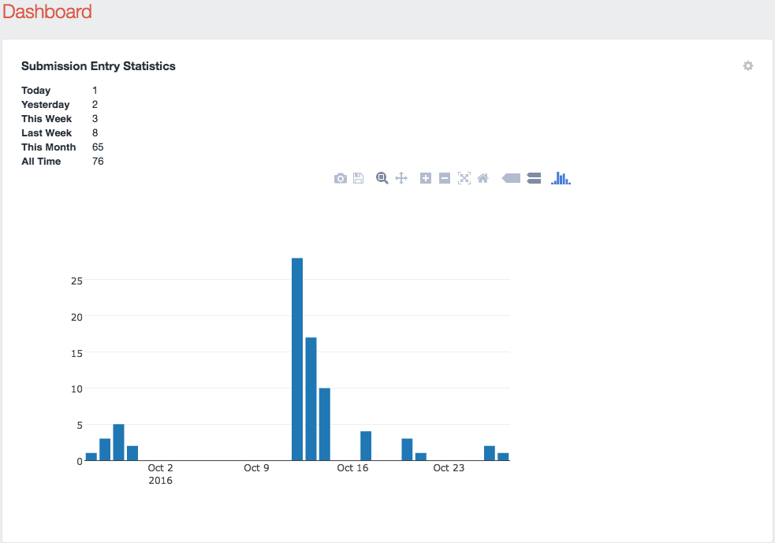

Entry Statistics
================
Get a count and plot.ly graph by postDate for any entry type in your Craft CMS Dashboard.

#### Installation

* Copy the `entrystatistics` subfolder into `craft/plugins` so that there is a path  `craft/plugins/entrystatistics/EntrystatisticsPlugin.php`.
* Enable the plugin in the Craft CMS Control Panel -> Plugins
* Add a "Entry Stats" widget to your dashboard. 
* If graph option is enabled, widget width of 3 columns is recommended.

Feel Free to Hack it: change the plot type and other parameters in `entrystatistics/templates/body.html`, or mess with it via the plot.ly menu!
